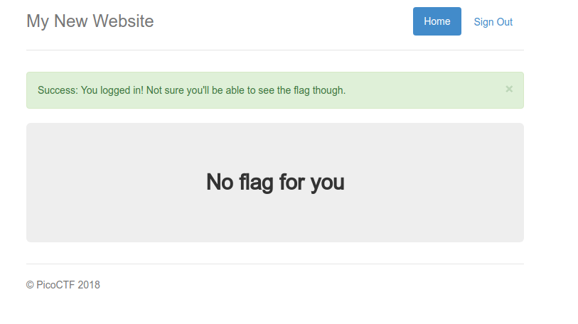
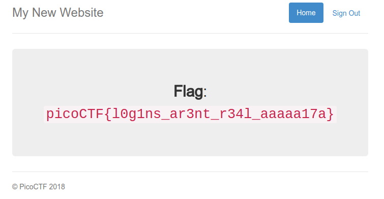

Following the link takes us to a login page. 
We are able to login by entering any arbitrary username and password.
When we login, we are taken to a page that looks like this:

It seems like we can't get the flag this way.
Let's try to login as an admin user.
Logging in with the username as `admin` and the password as any value displays the message: `I'm sorry the admin password is super secure. You're not getting in that way.`.
We need to find another way to login as an admin user.

If we login as a non-admin user, and check the cookie for this particular website (I used the `EditThisCookie` browser extension for Google Chrome), we can see that there are 3 fields: `username`, `password` and `admin`. `username` and `password` are the values entered when initially logging in. The `admin` field is a boolean which is currently set to `False`. If we change the value to `True` and reload the page, the flag gets displayed:

Flag: `picoCTF{l0g1ns_ar3nt_r34l_aaaaa17a}`
