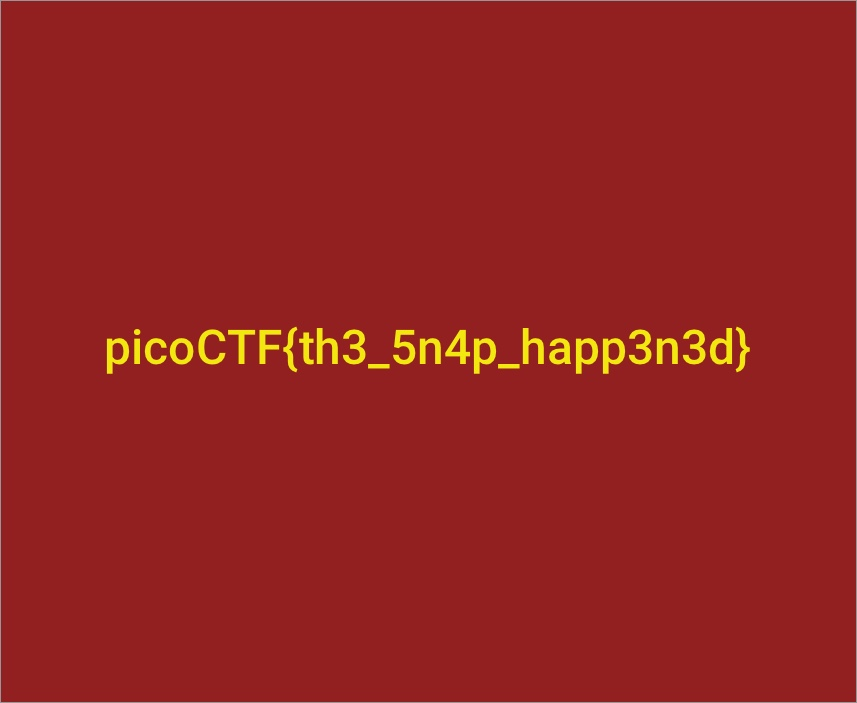

We are a given an image file, and we need to recover some files from it.
First I checked what readable text is contained within the file using `strings`.
After executing `strings animals.dd > recover.txt`, the first 12 lines of `recover.txt` were:
```
mkfs.fat
NO NAME    FAT16   
This is not a bootable disk.  Please insert a bootable floppy and
press any key to try again ... 
DACHSH~1JPG 
OX     JPG 
FROG    JPG 
IRAFFE JPG 
MUSIC   JPG 
ABBIT2 JPG 
RABBIT  JPG 
HEFLAG JPG 
``` 
We can see some JPEG files, and these might be the files that we need to extract.
For file carving, we can use a tool called `scalpel`.
After modifying `scalpel.conf` to extract JPEG files, and executing `scalpel animals.dd`, 8 images were extracted.
One of them contained the flag:


Flag: `picoCTF{th3_5n4p_happ3n3d}`
