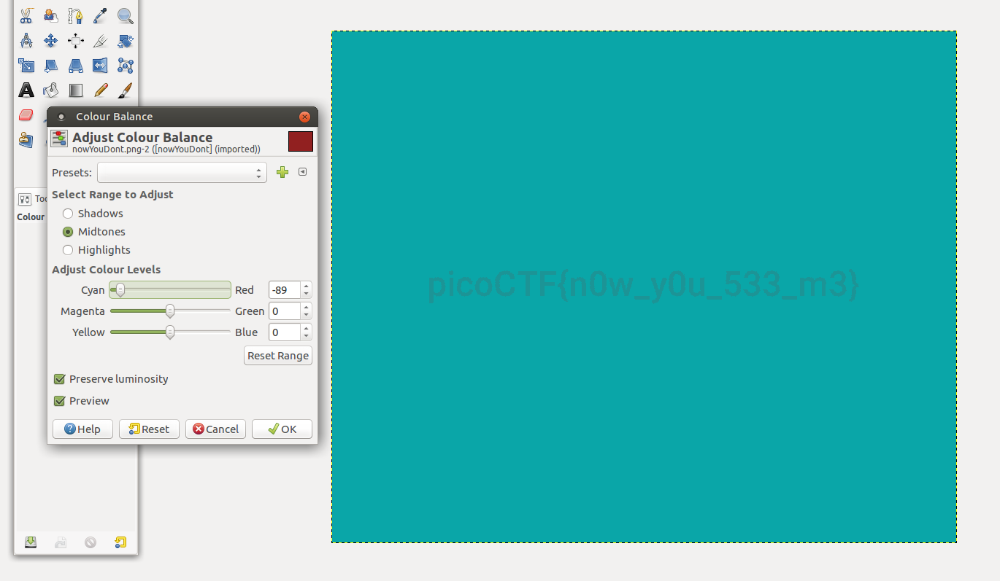

Although the entire image given appears to be the same shade of red, it is possible that some of the pixels are a slightly different shade of red. 
We can check this by opening the image in an image editor (I used `GIMP`) and modifying the colours. If you lower the cyan levels by the right amount, you can see the flag in the image.

Flag: `picoCTF{n0w_y0u_533_m3}`
